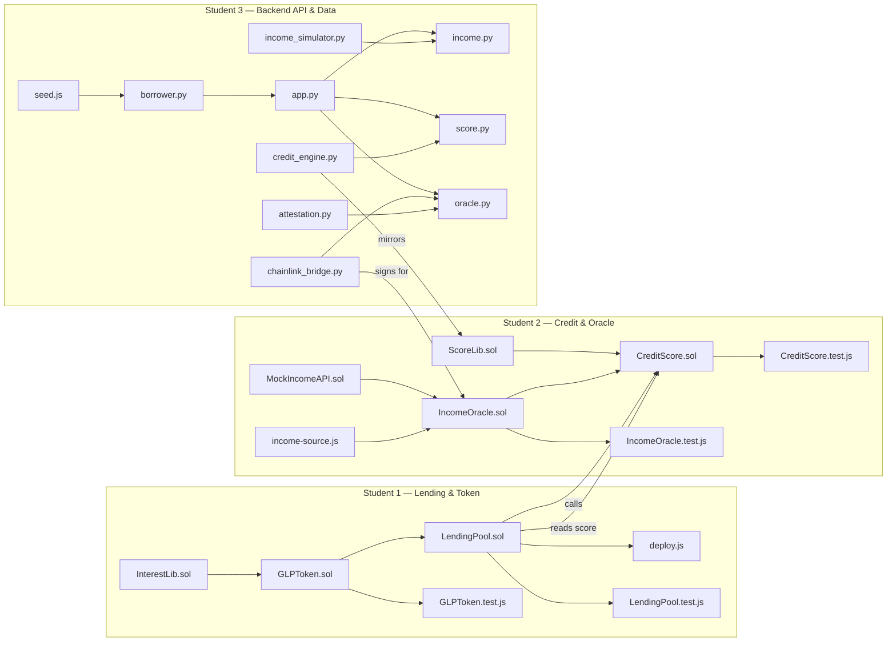

# Blockchain-project
# GigLend — 60% Implementation Plan (Backend-Focused, 3-Student Split)

## Project Summary

GigLend is a decentralised micro-lending platform for gig workers, built on Ethereum (Sepolia testnet). It uses on-chain credit scoring, Chainlink oracle-based income verification, and an ERC-20 pool token for lender shares. This plan covers the **60% implementation milestone** — the core logic that makes the system functional end-to-end, with clear TODOs marking the remaining 40%.

> [!IMPORTANT]
> **No frontend work is included in this plan.** All three students work on backend: smart contracts, off-chain API, and the glue between them. The frontend (`frontend/src/`) will be built in the remaining 40% phase.

---

## Three-Student Split



---

## Student 1 — Lending Engine & Pool Token

**Scope:** All ETH movement, pool share accounting, and deployment pipeline.

### Files & Responsibilities

| File | Purpose | 60% Scope | Remaining 40% |
|------|---------|-----------|----------------|
| [InterestLib.sol](file:///c:/Users/DELL/Desktop/project%20vit/giglend/contracts/libraries/InterestLib.sol) ✅ | Pure interest math | `annualRateBps()`, `calculateInterest()`, `totalRepayment()` — simple linear model | Compound interest, utilisation-curve (kink model like Aave) |
| [GLPToken.sol](file:///c:/Users/DELL/Desktop/project%20vit/giglend/contracts/core/GLPToken.sol) ✅ | ERC-20 pool share token | `mint()`, `burn()`, only callable by LendingPool (owner) | Transfer fees, EIP-2612 permit(), snapshot voting |
| **LendingPool.sol** | Core lending contract | `deposit()` → mints GLP, `withdraw()` → burns GLP + returns ETH+interest, `borrow()` → checks credit score + disburses, `repay()` → accepts ETH + updates state | Liquidation engine, flash loans, multi-collateral support |
| **deploy.js** | Deploys all contracts in order | Deploy InterestLib → GLPToken → CreditScore → IncomeOracle → LendingPool, link libraries, wire addresses | Proxy upgradability (UUPS), verify on Etherscan |
| **LendingPool.test.js** | Unit tests | Test deposit/withdraw/borrow/repay flows, edge cases (zero amount, insufficient balance) | Fuzzing, gas benchmarks |
| **GLPToken.test.js** | Unit tests | Test mint/burn permissions, transfer, balance queries | Permit tests, snapshot tests |

### Key Design Decisions

- **Share pricing:** 1 GLP = 1 ETH at genesis. As interest accrues, the pool's ETH grows but GLP supply stays fixed → each GLP is worth more ETH over time (compound share model, similar to Compound's cToken).
- **Borrow cap:** A borrower can borrow up to `maxLTV * collateralValue`, where `maxLTV` is determined by their credit score (higher score → higher LTV).
- **Interest model (60%):** Simple linear: `rate = 5% + 20% × (900 - score) / 600`. A 750-score borrower pays 10% APR.

---

## Student 2 — Credit Scoring & Oracle System

**Scope:** On-chain credit score storage, Chainlink Functions integration for income verification, and the mock oracle for local testing.

### Files & Responsibilities

| File | Purpose | 60% Scope | Remaining 40% |
|------|---------|-----------|----------------|
| [ScoreLib.sol](file:///c:/Users/DELL/Desktop/project%20vit/giglend/contracts/libraries/ScoreLib.sol) ✅ | Pure score formula | `computeScore(repayment, utilisation, age, income)` → weighted sum mapped to [300, 900] | Late-payment decay, cross-platform attestation bonus, governance-updatable weights |
| **CreditScore.sol** | Score storage + updates | `updateScore()` (only callable by oracle or admin), `getScore()`, stores per-borrower struct with sub-scores | Score history (array of past scores), dispute mechanism, decay over time |
| **IncomeOracle.sol** | Chainlink Functions consumer | `requestIncomeVerification()` sends a request, `fulfillRequest()` callback stores verified income | Multi-source aggregation (Uber + Swiggy + Zepto), request batching |
| **MockIncomeAPI.sol** | Local test oracle | Simulates `fulfillRequest()` with hardcoded responses for 5 test borrowers | Randomised failure injection, latency simulation |
| **income-source.js** | Chainlink DON source code | JavaScript that runs inside Chainlink Functions — calls the backend `/api/oracle/sign` endpoint and returns signed income data | Multi-API aggregation, retry logic |
| **CreditScore.test.js** | Unit tests | Test score computation, update permissions, boundary values (300, 900) | Integration test with oracle callback flow |
| **IncomeOracle.test.js** | Unit tests | Test request/fulfill cycle using MockIncomeAPI | Test with simulated Chainlink Functions coordinator |

### Key Design Decisions

- **Score formula weights:** Repayment history (35%), Utilisation ratio (30%), Account age (15%), Income stability (20%). These are coded in ScoreLib and mirrored exactly in Python's `credit_engine.py`.
- **Oracle trust model:** The oracle is the only entity that can update scores (besides admin for manual override). This prevents borrowers from self-reporting.
- **Mock strategy:** `MockIncomeAPI.sol` inherits the same interface as `IncomeOracle.sol` so tests can swap them without changing LendingPool.

---

## Student 3 — Backend API & Data Layer

**Scope:** Flask REST API, MongoDB data persistence, income simulation for demo, and the Chainlink bridge that signs oracle responses.

### Files & Responsibilities

| File | Purpose | 60% Scope | Remaining 40% |
|------|---------|-----------|----------------|
| **app.py** | Flask entry point | App factory, CORS, register blueprints, MongoDB init | Rate limiting, JWT auth, error middleware |
| **routes/income.py** | `/api/income/*` | `GET /api/income/<address>` returns simulated gig income, `POST /api/income/verify` triggers oracle | Webhook for real platform APIs |
| **routes/score.py** | `/api/score/*` | `GET /api/score/<address>` returns current credit score + breakdown, `POST /api/score/recalculate` | Score history endpoint, dispute submission |
| **routes/oracle.py** | `/api/oracle/sign` | Accepts income data, signs it with the oracle private key, returns signature for Chainlink Functions | Request validation, nonce tracking, replay protection |
| **services/income_simulator.py** | 20 pre-built gig worker profiles | Each profile has: platform (Uber/Swiggy/Zepto), monthly earnings (3–6 months), consistency rating | Randomised profile generation, seasonal patterns |
| **services/credit_engine.py** | Python mirror of ScoreLib.sol | Exact same formula: `compute_score(repayment, utilisation, age, income)` → [300, 900] | ML-based score prediction, what-if analysis |
| **services/chainlink_bridge.py** | Signs oracle responses | Uses `eth_account` to sign income attestation with the oracle's private key | Multi-sig signing, threshold signatures |
| **services/attestation.py** | Full attestation pipeline | Combines income data + timestamp + borrower address → EIP-712 typed data → signature | Attestation verification, expiry management |
| **models/borrower.py** | MongoDB schema + CRUD | `Borrower` model with fields: address, name, platform, income_history, score, loans | Loan model, repayment schedule model, indexing |
| **seed.js** | Seeds demo data | Creates 20 borrowers in MongoDB + funds them on Sepolia with test ETH via Hardhat | Reset script, panel-ready demo scenarios |

### Key Design Decisions

- **Why Flask (not Express)?** The credit engine uses NumPy for statistics and Python is better suited for the mathematical mirror of ScoreLib. Also aligns with VIT's Python-heavy curriculum.
- **MongoDB schema:** Denormalised for speed — each borrower document embeds their income history and loan records. This avoids JOINs and keeps the demo snappy.
- **Oracle signing:** Uses EIP-712 structured data signing so the on-chain contract can verify the signature with `ecrecover`.

---

## Files Already Created (✅)

These 4 files are already in the workspace:

| File | Student |
|------|---------|
| [hardhat.config.js](file:///c:/Users/DELL/Desktop/project%20vit/giglend/hardhat.config.js) | Shared |
| [InterestLib.sol](file:///c:/Users/DELL/Desktop/project%20vit/giglend/contracts/libraries/InterestLib.sol) | Student 1 |
| [ScoreLib.sol](file:///c:/Users/DELL/Desktop/project%20vit/giglend/contracts/libraries/ScoreLib.sol) | Student 2 |
| [GLPToken.sol](file:///c:/Users/DELL/Desktop/project%20vit/giglend/contracts/core/GLPToken.sol) | Student 1 |

---

## Files Remaining to Generate

### Student 1 (3 files)
- `contracts/core/LendingPool.sol`
- `test/LendingPool.test.js`
- `test/GLPToken.test.js`

### Student 2 (5 files)
- `contracts/core/CreditScore.sol`
- `contracts/core/IncomeOracle.sol`
- `contracts/mocks/MockIncomeAPI.sol`
- `chainlink/income-source.js`
- `test/CreditScore.test.js`
- `test/IncomeOracle.test.js`

### Student 3 (11 files)
- `backend/app.py`
- `backend/routes/income.py`
- `backend/routes/score.py`
- `backend/routes/oracle.py`
- `backend/services/income_simulator.py`
- `backend/services/credit_engine.py`
- `backend/services/chainlink_bridge.py`
- `backend/services/attestation.py`
- `backend/models/borrower.py`
- `scripts/deploy.js`
- `scripts/seed.js`

### Shared (3 files)
- `package.json`
- `.env.example`
- `backend/requirements.txt`

---

## Verification Plan

### Automated Tests
```bash
# Smart contract tests (Student 1 + Student 2)
npx hardhat test

# Backend API tests (Student 3)
cd backend && python -m pytest tests/ -v
```

### Manual Verification
1. Deploy contracts to local Hardhat node → verify all addresses linked correctly.
2. Run `seed.js` to populate 20 demo borrowers.
3. Call the full cycle via API: verify income → compute score → borrow → repay → check updated score.
4. Deploy to Sepolia testnet and run the same cycle with MetaMask.

---

## What the Remaining 40% Covers (Post-Approval)

| Area | Work |
|------|------|
| Frontend | All of `frontend/src/` — React + ethers.js dashboard |
| Advanced interest | Compound interest, utilisation-curve kink model |
| Liquidation | Auto-liquidation when health factor < 1 |
| Security | Reentrancy guards, access control audit, EIP-2612 |
| Governance | Score weight voting via GLP token snapshots |
| Documentation | Full report (IEEE template), PPT slides, README |
