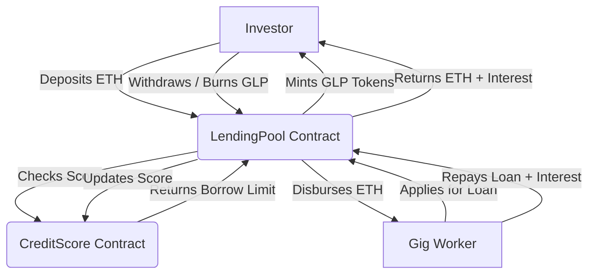

# Decentralized Micro-Lending Protocol

> A Decentralized Blockchain-Based Micro-Lending Protocol for Gig Economy Workers
> **Team:** Poovannaraajan (23BCE0759) · Madhan Kumar (23BCB0065) · Sanjay Jaishankar (23BCB0078)

---

## 📖 Project Overview

This project is a decentralized community lending protocol that enables collateral-free micro-loans for gig economy workers. Instead of relying on traditional banks or loan officers, this protocol uses on-chain reputation and verified income attestation to manage risk.

**Key Features:**
- **No traditional backend** — Smart contracts replace the server entirely.
- **No database** — The blockchain serves as the permanent, auditable data layer.
- **Automated Operations** — Smart contracts automatically handle loan approval, disbursement, and repayment.
- **Uncollateralized** — Borrowing limits are strictly gated by an on-chain Credit Score algorithm rather than upfront crypto collateral.

## 🏗 Architecture



## 🛠 Tech Stack

- **Smart Contracts:** Solidity, Hardhat, OpenZeppelin
- **Frontend:** React.js, Vite, Ethers.js v6
- **Wallet & Network:** MetaMask, Ethereum (Local Node / Sepolia Testnet)

## 💻 Installation & Setup

### 1. Prerequisites
- Node.js installed
- MetaMask browser extension installed

### 2. Install Dependencies
Clone the repository and install all required packages:
```bash
# Install smart contract dependencies
npm install

# Install frontend dependencies
cd frontend
npm install
```

### 3. Environment Setup (For Sepolia Deployment)
Create a `.env` file in the root directory (do not commit this!):
```env
PRIVATE_KEY=your_metamask_private_key
SEPOLIA_RPC_URL=your_alchemy_or_infura_url
ETHERSCAN_API_KEY=your_etherscan_api_key
```

## 🚀 Running Locally

To run the full stack locally on your machine, you need two terminal windows:

### Terminal 1: Start the Local Blockchain Node
```bash
npx hardhat node
```
*This will start a local Ethereum network and give you 20 test accounts. Import the private key of Account 0 into MetaMask to act as the deployer and investor.*

### Terminal 2: Deploy Contracts & Start Frontend
```bash
# Deploy contracts to your local node
npx hardhat run scripts/deploy.js --network localhost

# Start the React frontend
cd frontend
npm run dev
```

## 🌐 Deploying to Sepolia Testnet

When you are ready to deploy the live smart contracts to the Sepolia testnet:
```bash
npx hardhat run scripts/deploy.js --network sepolia
```
*Once deployed, update the contract addresses in `frontend/src/utils/contractHelpers.js` before running the frontend.*

## 👥 Team Contributions

- **Poovannaraajan (23BCE0759):** Smart Contracts (`LendingPool.sol`, `GLPToken.sol`, etc.), Hardhat configuration, Sepolia deployment, Chainlink research.
- **Madhan Kumar (23BCB0065):** Frontend Development (React + Vite), UI components, Ethers.js integration, MetaMask wallet connection.
- **Sanjay Jaishankar (23BCB0078):** Credit Scoring Algorithm design, Unit Testing, Documentation, Architecture design.
